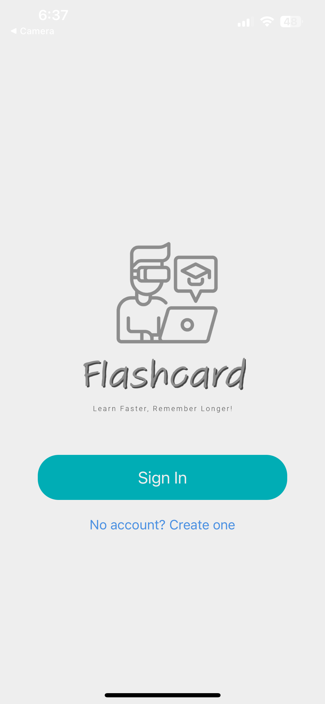
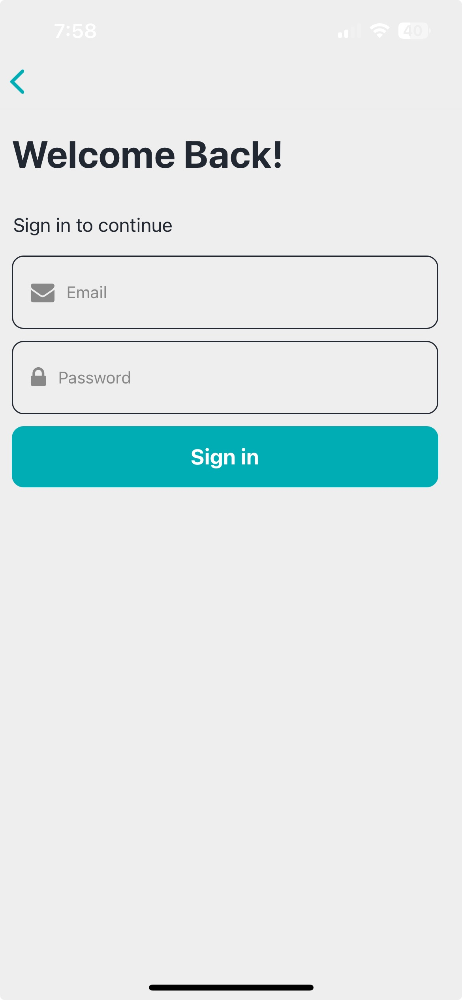
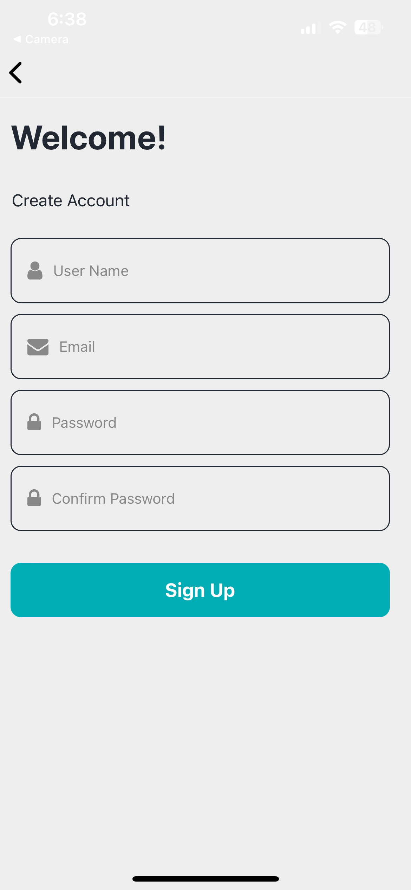
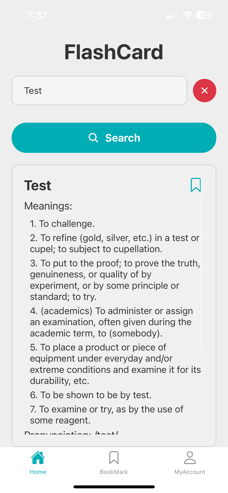
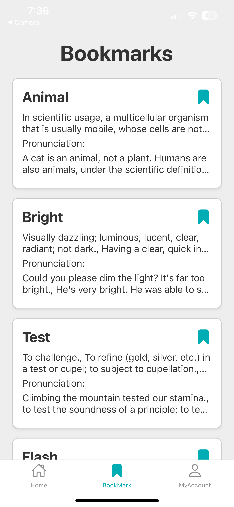
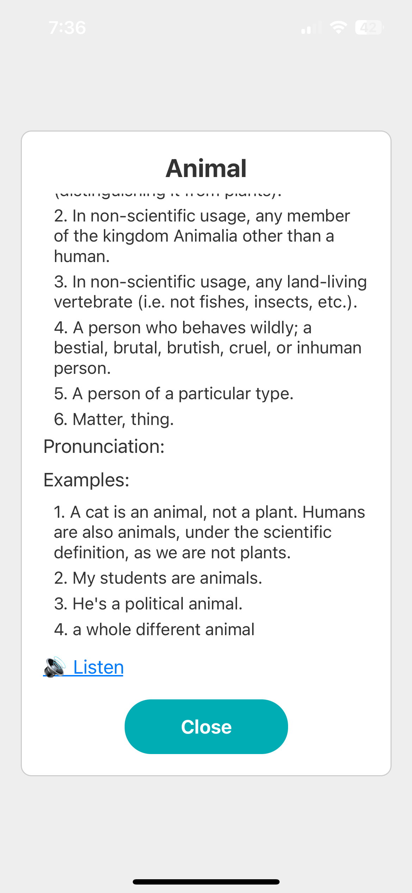
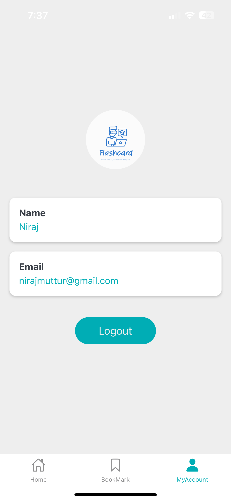

# Flash Card App

## Overview

The FlashCard App is a mobile application built with React Native that allows users to search for the meaning, pronunciation, and examples of any word. Users can also bookmark their favorite words for future reference. The app includes audio pronunciations for words, with loading indicators to enhance user experience.


## Features

- Search for word meanings, pronunciations, and examples.
- Listen to audio pronunciations of words.
- Bookmark favorite words for quick access.
- User authentication and personalized bookmark storage.


## Tech Stack

**Client:** React Native, Expo

**Backend as Service:** Appwrite


## Run Locally

Clone the project

```bash
  git clone https://github.com/Nirajmuttur/flashcard
```

Go to the project directory

```bash
  cd my-project
```

Install dependencies

```bash
  npm install
```

Start the server

```bash
  npx expo start
```


## Environment Variables

To run this project, you will need to add the following environment variables to your .env file

`APPWRITE_FUNCTION_URL`

`APPWRITE_COLLECTION_ID`

`APPWRITE_DATABASE_ID`

`APPWRITE_ENDPOINT`

`APPWRITE_PROJECT_ID`


## Screenshots









